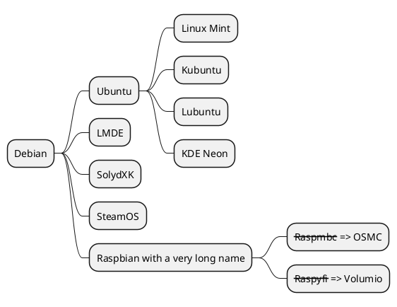

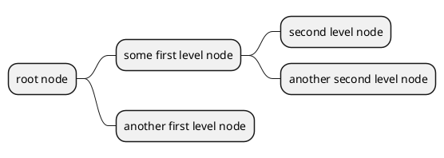

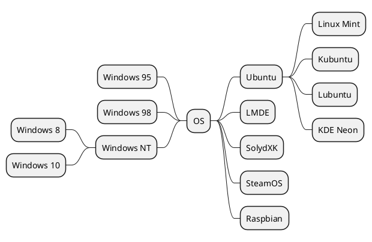

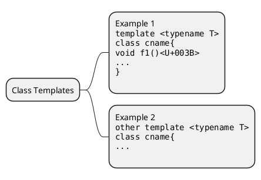

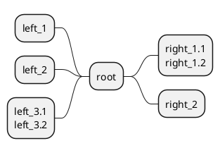

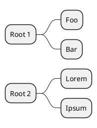

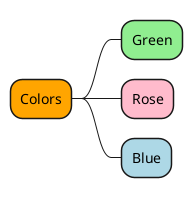


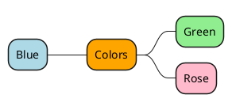

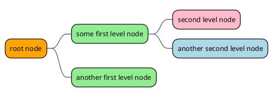

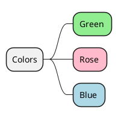

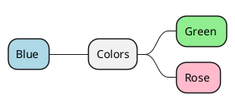

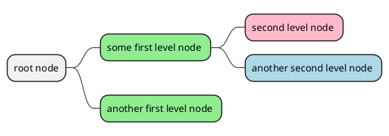

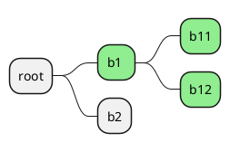

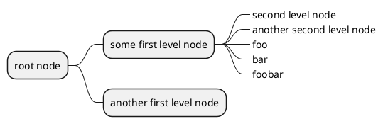

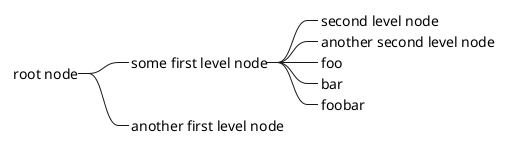

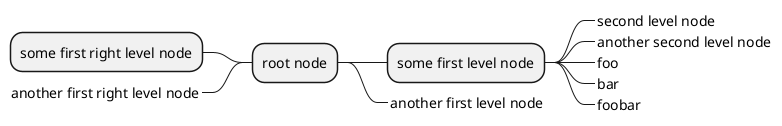

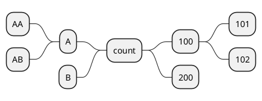

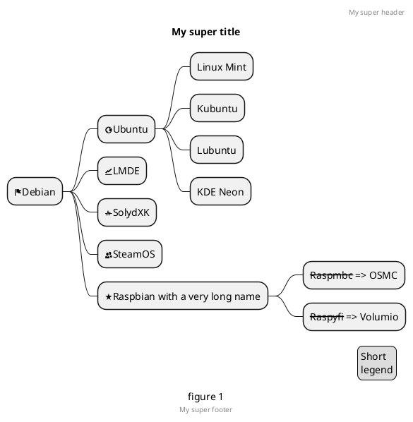

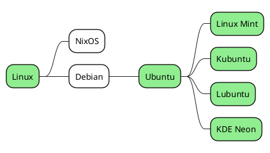

```plantuml
@startmindmap
<style>
mindmapDiagram {
  node {
    BackgroundColor lightGreen
  }
  boxless {
    FontColor darkgreen
  }
}
</style>
* Linux
** NixOS
** Debian
***_ Ubuntu
**** Linux Mint
**** Kubuntu
**** Lubuntu
**** KDE Neon
@endmindmap
```

```plantuml
@startmindmap


<style>
node {
    Padding 12
    Margin 3
    HorizontalAlignment center
    LineColor blue
    LineThickness 3.0
    BackgroundColor gold
    RoundCorner 40
    MaximumWidth 100
}

rootNode {
    LineStyle 8.0;3.0
    LineColor red
    BackgroundColor white
    LineThickness 1.0
    RoundCorner 0
    Shadowing 0.0
}

leafNode {
    LineColor gold
    RoundCorner 0
    Padding 3
}

arrow {
    LineStyle 4
    LineThickness 0.5
    LineColor green
}
</style>

* Hi =)
** sometimes i have node in wich i want to write a long text
*** this results in really huge diagram
**** of course, i can explicit split with a\nnew line
**** but it could be cool if PlantUML was able to split long lines, maybe with an option 

@endmindmap
```

```plantuml
@startmindmap
* Creole on Mindmap
left side
**:==Creole
  This is **bold**
  This is //italics//
  This is ""monospaced""
  This is --stricken-out--
  This is __underlined__
  This is ~~wave-underlined~~
--test Unicode and icons--
  This is <U+221E> long
  This is a <&code> icon
  Use image : 
;
**: <b>HTML Creole 
  This is <b>bold</b>
  This is <i>italics</i>
  This is <font:monospaced>monospaced</font>
  This is <s>stroked</s>
  This is <u>underlined</u>
  This is <w>waved</w>
  This is <s:green>stroked</s>
  This is <u:red>underlined</u>
  This is <w:#0000FF>waved</w>
-- other examples --
  This is <color:blue>Blue</color>
  This is <back:orange>Orange background</back>
  This is <size:20>big</size>
;
right side
**:==Creole line
You can have horizontal line
----
Or double line
====
Or strong line
____
Or dotted line
..My title..
Or dotted title
//and title... //
==Title==
Or double-line title
--Another title--
Or single-line title
Enjoy!;
**:==Creole list item
**test list 1**
* Bullet list
* Second item
** Sub item
*** Sub sub item
* Third item
----
**test list 2**
# Numbered list
# Second item
## Sub item
## Another sub item
# Third item
;
@endmindmap
```
